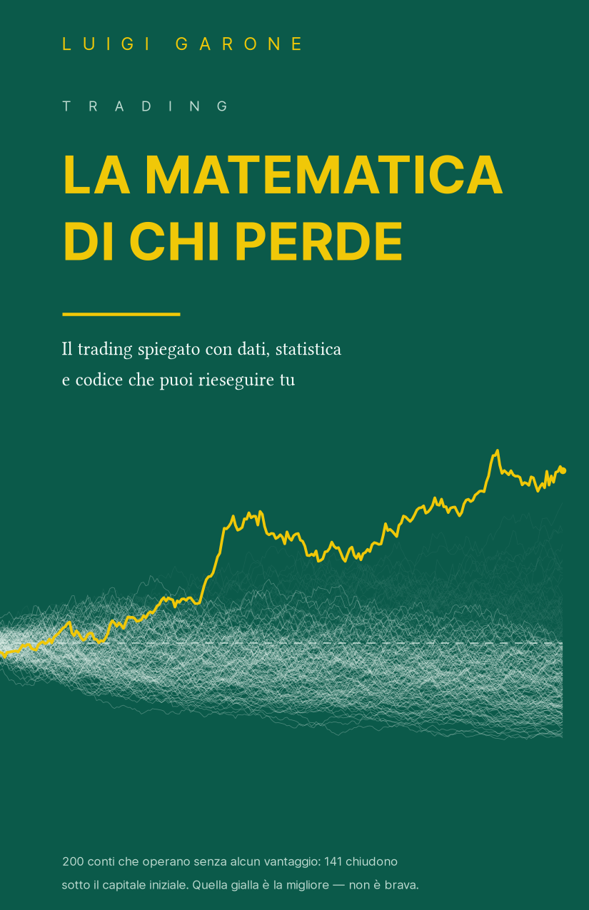

# The Mathematics of Losing — the code

> *Trading explained with data, statistics, and code you can rerun yourself.*

*Leggi in [italiano](README.md).*



The cover is a dataset too: two hundred accounts trading with no edge whatsoever, each paying its own costs. One hundred and forty-one end below their starting capital. The yellow curve is the best of the two hundred — not skilled, just lucky, and exactly the chart someone would show you.

This repository contains **all the code behind the book** «La matematica di chi perde» (Luigi Garone): the 21 labs, the 8 calculators, the `cvbook` computation engine, the generators of the 43 printed figures, and the frozen data snapshots everything runs on.

The book does not ask to be taken on faith. Every claim in it comes from a computation, every computation lives in this repository, and every figure can be reproduced by running the code on the **frozen data** the book used to print it. If a number doesn't convince you, open it and challenge it.

<br clear="all">

---

## How to use it

### In a browser, nothing to install

Every notebook opens in **Google Colab** with one click. The first cell fetches the `cvbook` engine and the data it needs: there is nothing to configure.

In the printed book, each lab sits next to a QR code and a short address of the form `lab.cryptoverso.net/l01`, pointing to the same notebook. The short addresses go live when the site is published; the Colab links below already work.

### On your machine

```bash
git clone https://github.com/cryptoverso-lab/matematica-di-chi-perde.git
cd matematica-di-chi-perde
uv sync
uv run jupyter lab codice/lab
```

You need **Python 3.12 or later**. With [uv](https://docs.astral.sh/uv/), dependencies are pinned by `uv.lock`, so you get the exact versions the book was printed with. When you clone the repository, the notebooks detect they are running locally and use the local files instead of downloading them.

---

## The 21 labs

In the order they appear in the book. Notebooks are in Italian.

| | The question it answers | Open |
|---|---|---|
| **Lab 1** | How many retail accounts end up losing, and how fast | [Colab](https://colab.research.google.com/github/cryptoverso-lab/matematica-di-chi-perde/blob/main/codice/lab/lab_01_chi_perde.ipynb) |
| **Lab 2** | Equity curves generated by pure chance, and the prettiest among a thousand | [Colab](https://colab.research.google.com/github/cryptoverso-lab/matematica-di-chi-perde/blob/main/codice/lab/lab_02_equity_casuali.ipynb) |
| **Lab 3** | Token mortality and survivorship bias | [Colab](https://colab.research.google.com/github/cryptoverso-lab/matematica-di-chi-perde/blob/main/codice/lab/lab_03_cimitero_token.ipynb) |
| **Lab 4** | Loss aversion and the disposition effect, measured on your own numbers | [Colab](https://colab.research.google.com/github/cryptoverso-lab/matematica-di-chi-perde/blob/main/codice/lab/lab_04_bias.ipynb) |
| **Lab 5** | Three ways of looking at the same data, and telling real from fake | [Colab](https://colab.research.google.com/github/cryptoverso-lab/matematica-di-chi-perde/blob/main/codice/lab/lab_05_misurare.ipynb) |
| **Lab 6** | Fat tails, kurtosis, and the twenty days that decide everything | [Colab](https://colab.research.google.com/github/cryptoverso-lab/matematica-di-chi-perde/blob/main/codice/lab/lab_06_code_grasse.ipynb) |
| **Lab 7** | Rolling correlations, and how much they rise in crashes | [Colab](https://colab.research.google.com/github/cryptoverso-lab/matematica-di-chi-perde/blob/main/codice/lab/lab_07_correlazioni.ipynb) |
| **Lab 8** | Principal components and the effective number of bets | [Colab](https://colab.research.google.com/github/cryptoverso-lab/matematica-di-chi-perde/blob/main/codice/lab/lab_08_acp.ipynb) |
| **Lab 9** | Rolling volatility, regime persistence, and how long turbulence lasts | [Colab](https://colab.research.google.com/github/cryptoverso-lab/matematica-di-chi-perde/blob/main/codice/lab/lab_09_regimi.ipynb) |
| **Lab 10** | More parameters: fits both perfect and useless | [Colab](https://colab.research.google.com/github/cryptoverso-lab/matematica-di-chi-perde/blob/main/codice/lab/lab_10_dimensionalita.ipynb) |
| **Lab 11** | How many observations it takes to tell an edge from luck | [Colab](https://colab.research.google.com/github/cryptoverso-lab/matematica-di-chi-perde/blob/main/codice/lab/lab_11_potere.ipynb) |
| **Lab 12** | An honest backtest, line by line, and the yardstick generator | [Colab](https://colab.research.google.com/github/cryptoverso-lab/matematica-di-chi-perde/blob/main/codice/lab/lab_12_backtest_base.ipynb) |
| **Lab 13** | Lookahead, invariance tests, and the five data checks | [Colab](https://colab.research.google.com/github/cryptoverso-lab/matematica-di-chi-perde/blob/main/codice/lab/lab_13_bias_dati.ipynb) |
| **Lab 14** | Twenty edgeless strategies and the multiple-testing correction | [Colab](https://colab.research.google.com/github/cryptoverso-lab/matematica-di-chi-perde/blob/main/codice/lab/lab_14_bias_metodo.ipynb) |
| **Lab 15** | Optimizing a meaningless rule, in and out of sample | [Colab](https://colab.research.google.com/github/cryptoverso-lab/matematica-di-chi-perde/blob/main/codice/lab/lab_15_ottimizzazione.ipynb) |
| **Lab 16** | Six textbook rules measured together, with the three controls | [Colab](https://colab.research.google.com/github/cryptoverso-lab/matematica-di-chi-perde/blob/main/codice/lab/lab_16_analisi_tecnica.ipynb) |
| **Lab 17** | The two coordinates of a market move, and volume put to the test | [Colab](https://colab.research.google.com/github/cryptoverso-lab/matematica-di-chi-perde/blob/main/codice/lab/lab_17_prezzo_e_tempo.ipynb) |
| **Lab 18** | A thousand paths instead of one, and the three numbers that decide | [Colab](https://colab.research.google.com/github/cryptoverso-lab/matematica-di-chi-perde/blob/main/codice/lab/lab_18_montecarlo.ipynb) |
| **Lab 19** | The five checks to run on your own working environment | [Colab](https://colab.research.google.com/github/cryptoverso-lab/matematica-di-chi-perde/blob/main/codice/lab/lab_19_strumenti.ipynb) |
| **Lab 20** | Random seeds, vectorization, reproducibility | [Colab](https://colab.research.google.com/github/cryptoverso-lab/matematica-di-chi-perde/blob/main/codice/lab/lab_20_basi.ipynb) |
| **Lab 21** | Two implementations of the same strategy: find the lookahead | [Colab](https://colab.research.google.com/github/cryptoverso-lab/matematica-di-chi-perde/blob/main/codice/lab/lab_21_ai.ipynb) |

## The 8 calculators

Tools to run on your own numbers — not demonstrations.

| | What it computes | Open |
|---|---|---|
| **Calculator 1** | How much you must gain to recover a loss | [Colab](https://colab.research.google.com/github/cryptoverso-lab/matematica-di-chi-perde/blob/main/codice/lab/calc_01_recupero_perdite.ipynb) |
| **Calculator 2** | Cumulative costs over a year of trading, as frequency varies | [Colab](https://colab.research.google.com/github/cryptoverso-lab/matematica-di-chi-perde/blob/main/codice/lab/calc_02_costi.ipynb) |
| **Calculator 3** | Time under water and the position size your tolerance can carry | [Colab](https://colab.research.google.com/github/cryptoverso-lab/matematica-di-chi-perde/blob/main/codice/lab/calc_03_stop_sizing.ipynb) |
| **Calculator 4** | Optimal fraction, risk of ruin, overall risk | [Colab](https://colab.research.google.com/github/cryptoverso-lab/matematica-di-chi-perde/blob/main/codice/lab/calc_04_dimensionamento.ipynb) |
| **Calculator 5** | Probability of a custody event and the cost of concentration | [Colab](https://colab.research.google.com/github/cryptoverso-lab/matematica-di-chi-perde/blob/main/codice/lab/calc_05_custodia.ipynb) |
| **Calculator 6** | Tax friction, carried-forward and expired losses | [Colab](https://colab.research.google.com/github/cryptoverso-lab/matematica-di-chi-perde/blob/main/codice/lab/calc_06_fisco.ipynb) |
| **Calculator 7** | The executable Criterion: unanswered questions and the yardstick of chance | [Colab](https://colab.research.google.com/github/cryptoverso-lab/matematica-di-chi-perde/blob/main/codice/lab/calc_07_criterio.ipynb) |
| **Calculator 8** | Generator of the written plan and the trade log | [Colab](https://colab.research.google.com/github/cryptoverso-lab/matematica-di-chi-perde/blob/main/codice/lab/calc_08_piano.ipynb) |

---

## The data

The notebooks **never call a market API**. They use frozen snapshots in `codice/dati/snapshot/` — the exact same files the book's figures were produced from. That is the condition for the figure you get to be the figure you are reading.

Eleven series: five crypto pairs from Binance's public data dumps — including one that no longer exists, because a graveyard with no headstones proves nothing — plus FTSE MIB, ENI, Enel, Intesa Sanpaolo, Generali, and EUR/USD from Yahoo Finance.

Every series is catalogued in [`codice/dati/registro.json`](codice/dati/registro.json): source, **extraction date** (August 16–17, 2026), covered range, row count, and the file's **SHA-256 fingerprint**. If a snapshot changed by a single byte, the tests would notice.

The scripts in `codice/ingest/` document **how** those series were built. They are run by hand, once, and are not needed to use the notebooks.

---

## The book's figures

Each of the **43 printed figures** has a dedicated generator in `codice/figure/` (`fig_*.py`) that reads the snapshots and produces the vector PDF laid out in the book. To regenerate them all:

```bash
uv run python codice/figure/genera_tutte.py
```

The figures use grayscale, hatching, and line styles, because the book's interior is printed in grayscale; `verifica_grigi.py` checks that none of them contains color. Same data, same seed, same figure: if you get one that differs from the printed one, you have found an error — report it.

---

## The tests

This repository carries the gate that belongs to it: `codice/testing/test_quaderni.py` **runs all 29 notebooks end to end** and checks that each one is referenced by a chapter. A notebook that does not run is not an unfinished notebook — it is a broken promise.

```bash
uv run pytest codice/testing
```

The book's full suite is **124 tests** and lives in the production repository, next to the manuscript: it also checks things that are not here — the absence of lookahead in the simulations, the correspondence between the numbers printed in the text and the computations behind them, the fingerprint of the frozen manuscript, and print-PDF conformance. Those tests cannot run without the text, and shipping tests that are bound to fail would be worse than not shipping them.

---

## Layout

```
codice/
├── lab/            the 29 notebooks, each in two formats:
│                   .ipynb for Colab and .py in percent format for readable diffs
├── src/cvbook/     the engine: metrics, simulations, plotting, the book's rules
├── figure/         the 43 figure generators + genera_tutte.py
├── dati/
│   ├── snapshot/   the eleven frozen series (.parquet)
│   └── registro.json   source, extraction date, and SHA-256 of every series
├── ingest/         how the snapshots were built
└── testing/        the gate that runs all 29 notebooks
assets/             logo and graphic assets
ERRATA.md           errors found after printing
```

Every notebook exists **twice**, as `.ipynb` and as `.py`. This is not duplication: the percent-format `.py` is the version you read in a review, because a diff on notebook JSON is unreadable. The two formats are kept in sync by `codice/lab/costruisci.py`.

---

## Errata

Errors found after printing are collected in **[ERRATA.md](ERRATA.md)**, with the date of the report and who filed it.

Reports are welcome: open an *issue* in this repository. Substantive corrections go into the next print run.

---

## How to cite

For the book:

```bibtex
@book{garone2026matematica,
  author = {Garone, Luigi},
  title  = {La matematica di chi perde. Il trading spiegato con dati,
            statistica e codice che puoi rieseguire tu},
  year   = {2026},
  note   = {Code and data: \url{https://github.com/cryptoverso-lab/matematica-di-chi-perde}}
}
```

Publication details (publisher, ISBN) will be completed at release. To cite only the code or the data, reference this repository and the commit.

---

## License

The **code** in this repository — the `cvbook` engine, labs, calculators, scripts — is released under the **MIT license**: see [LICENSE](LICENSE).

The **text of the book** and the print-ready figures are not in this repository and are not covered by the MIT license: they remain the property of Luigi Garone. What's here is the code, and the code is what you need to challenge the numbers.

---

## Scope

This material is for **education and research**. It is not investment advice, not a recommendation, and contains no trading signals. The calculators work on the numbers you feed them: they exist to show you the consequences of a choice, not to suggest one.

---

<div align="center">

<a href="https://cryptoverso.net"></a>

**CRYPTOVERSO**<br>
<sub>trading, ricerca, insights</sub>

</div>